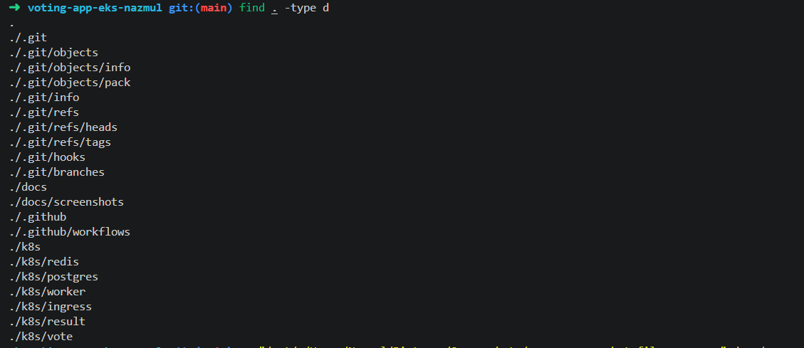

# Voting App on EKS

This is my Project 2 for the Ironhack DevOps bootcamp. In the capstone, I deployed this same polyglot voting app, Python vote UI, Node.js result UI, .NET worker, Redis, and Postgres, across a three-tier EC2 architecture using Terraform for provisioning and Ansible for configuration. This project takes the same app and moves it onto a managed Kubernetes cluster on EKS instead, with GitHub Actions handling the build and deploy pipeline automatically.

## Why EKS

We'd already run Kubernetes locally on Minikube earlier in the bootcamp, but Minikube is a single node on your own laptop. EKS gave me a chance to work with an actual multi-node cluster, IAM permissions, and a managed control plane, closer to what this would look like in a real job.

## Stack

I provisioned the cluster with eksctl, which handles the VPC, nodegroup, and IAM roles for you under the hood through CloudFormation. Once the cluster exists, everything else is kubectl. I used Helm to install the NGINX Ingress Controller, and GitHub Actions handles the CI/CD side: building the images, pushing them to Docker Hub, and applying the manifests.

## Setting up the project

I started by scaffolding the repo before touching AWS at all, with separate folders per service under k8s, so the manifests don't turn into a pile of loose YAML files in the root.

    mkdir -p k8s/redis k8s/postgres k8s/vote k8s/result k8s/worker k8s/ingress
    mkdir -p .github/workflows docs/screenshots

## Notes

I'll keep adding to this as I go, mostly documenting decisions and any issues I hit along the way, since that's usually more useful than a step that just worked first try.
