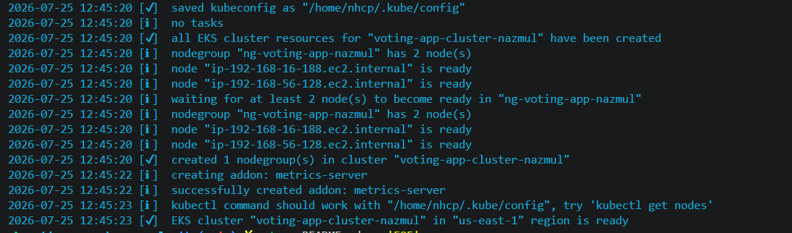
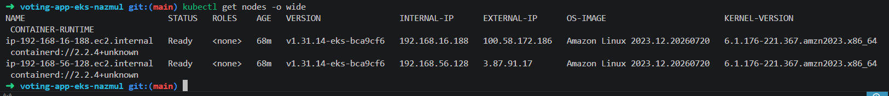
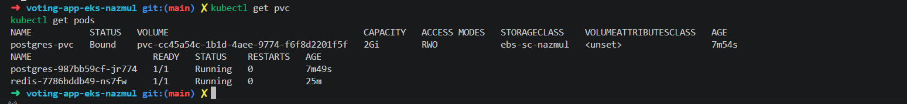
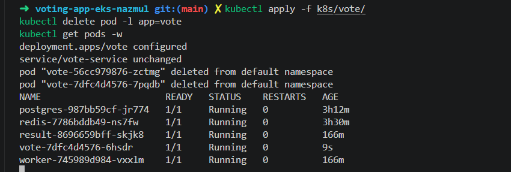
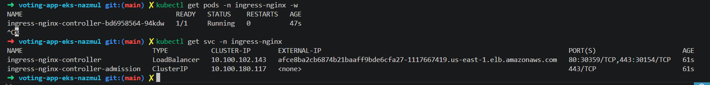
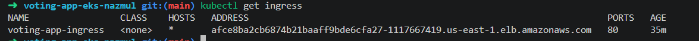
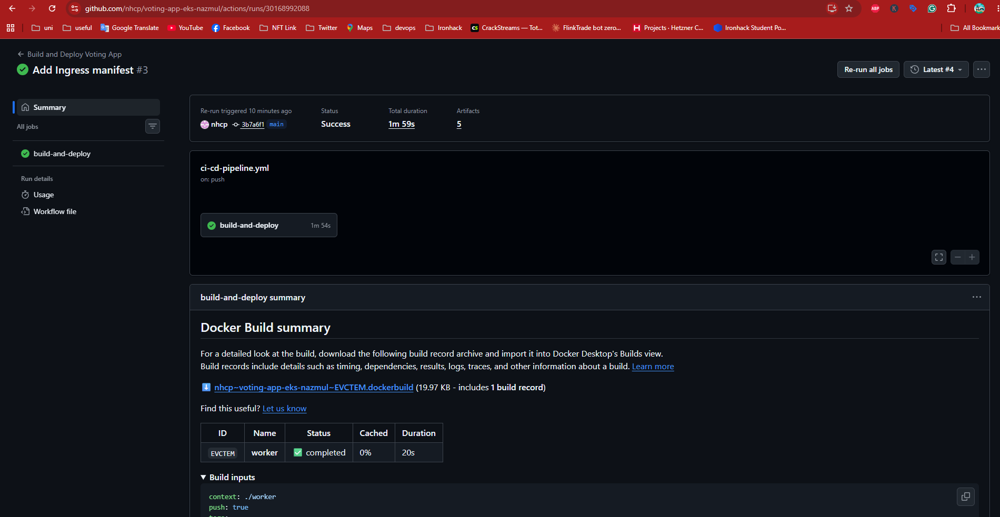
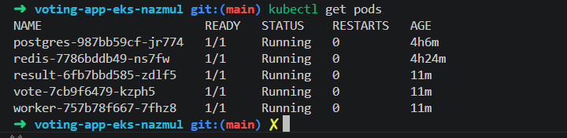
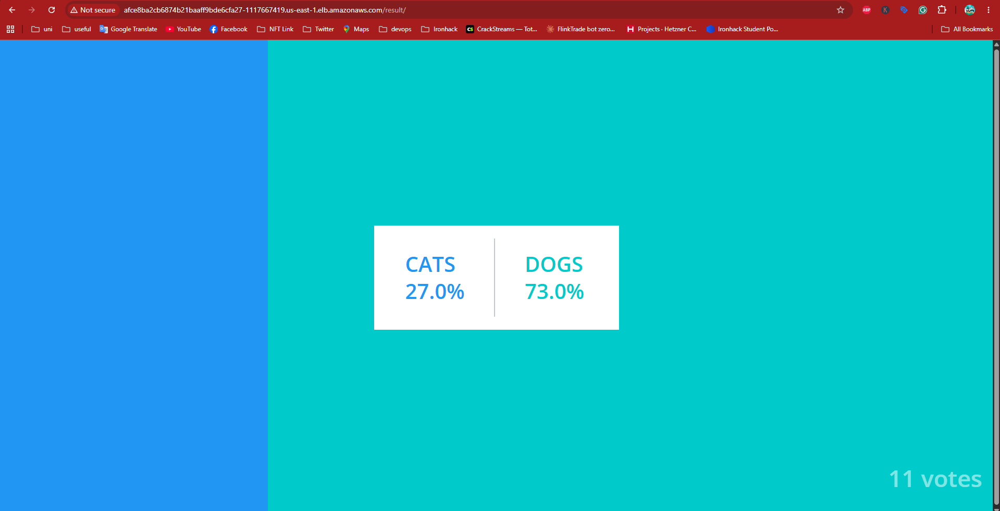

# Voting App on EKS

This is my Project 2 for the Ironhack DevOps bootcamp. In the capstone, I deployed this same polyglot voting app, Python vote UI, Node.js result UI, .NET worker, Redis, and Postgres, across a three-tier EC2 architecture using Terraform for provisioning and Ansible for configuration. This project takes the same app and moves it onto a managed Kubernetes cluster on EKS instead, with GitHub Actions handling the build and deploy pipeline automatically.

## Why EKS

We'd already run Kubernetes locally on Minikube earlier in the bootcamp, but Minikube is a single node on your own laptop. EKS gave me a chance to work with an actual multi-node cluster, IAM permissions, and a managed control plane, closer to what this would look like in a real job.

## Stack

I provisioned the cluster with eksctl, which handles the VPC, nodegroup, and IAM roles for you under the hood through CloudFormation. Once the cluster exists, everything else is kubectl. I used Helm to install the NGINX Ingress Controller, and GitHub Actions handles the CI/CD side: building the images, pushing them to Docker Hub, and applying the manifests.

## Setting up the project

I set up the folder structure first, one subfolder per service under k8s, so the manifests stay organized instead of piling up loose in the root.

    mkdir -p k8s/redis k8s/postgres k8s/vote k8s/result k8s/worker k8s/ingress
    mkdir -p .github/workflows docs/screenshots

## Provisioning the EKS cluster

Before any manifests can be applied, I need an actual cluster. I used eksctl since it handles the VPC, subnets, IAM roles, and worker nodes in one pass.

I kept the nodegroup small, two t3.medium nodes, since this runs on a shared classroom AWS account. Two nodes is still enough to show the services spreading across multiple machines, not just Minikube with extra steps.

    eksctl create cluster -f cluster-config.yaml --profile nazmul

This took about 15 minutes. eksctl built a CloudFormation stack behind the scenes: the EKS control plane, a VPC across two availability zones, IAM roles, and the EC2 nodes. It also wrote my kubeconfig automatically, so kubectl was ready immediately.

## Confirming the cluster is live

Once the cluster finished creating, I wanted proof it actually worked rather than trusting the eksctl output alone. Checking the nodes directly shows both EC2 instances registered with Kubernetes and marked Ready, running the Kubernetes version I asked for.

    kubectl get nodes -o wide

This confirms two things at once: kubectl is correctly pointed at the new cluster, and both nodes joined the cluster successfully and are healthy enough to run workloads. Nothing in Phase 2 can start until this comes back clean.

## Deploying Redis and Postgres

Redis and Postgres each got a Deployment to keep a container running, and a Service to give it a stable internal name. Redis came up immediately. Postgres also needed a Secret for its database credentials and a PersistentVolumeClaim for durable storage.

The PVC got stuck in Pending, tracing it through kubectl describe showed the pod could not schedule because the claim was unbound. The EBS CSI driver, which actually provisions AWS storage for Kubernetes, was not installed by default when the cluster was created. After installing it as an eksctl addon, the PVC was still not binding, since the only existing StorageClass on this shared classroom cluster used the older in-tree AWS provisioner rather than the CSI driver, and nothing pointed at it as default.

Fixed it by creating a StorageClass explicitly using the CSI provisioner and referencing it by name in the PVC directly, rather than relying on a default. Once applied, the PVC bound immediately and Postgres started.

    kubectl apply -f k8s/redis/
    kubectl apply -f k8s/postgres/

## Deploying vote, result, and worker

All three services pulled from images I had already built and pushed to Docker Hub during the capstone, so this phase was mostly about connecting them correctly to Redis and Postgres through environment variables. result and worker both needed their database host and credentials overridden to match the actual Postgres service and Secret in this cluster, rather than the generic defaults baked into the Dockerfiles.

vote crash looped on startup with a Python error trying to convert REDIS_PORT into a number. The cause was not the app or the manifest, it was Kubernetes itself. Kubernetes automatically injects an environment variable for every Service in the namespace, named after the service, and since the Redis Service is named redis, it injected its own REDIS_PORT as a full connection URI rather than a plain port number, silently overriding the plain integer the Dockerfile expected. Fixed it by setting REDIS_PORT explicitly in the pod spec, which takes precedence over the auto-injected one.

    kubectl apply -f k8s/vote/
    kubectl apply -f k8s/result/
    kubectl apply -f k8s/worker/

## Installing the NGINX Ingress Controller

Every service so far only exists inside the cluster, nothing outside AWS could reach vote or result yet. The Ingress Controller is what exposes them to the internet and routes different URL paths to the right backend service. I used Helm to install it rather than writing the underlying resources by hand, since it is a fairly large bundle, RBAC rules, a controller Deployment, and a LoadBalancer Service.

    helm repo add ingress-nginx https://kubernetes.github.io/ingress-nginx
    helm install ingress-nginx ingress-nginx/ingress-nginx --namespace ingress-nginx --create-namespace

On AWS, a LoadBalancer type Service is not just an internal thing, EKS automatically provisions a real Elastic Load Balancer for it. Once the controller pod was running, kubectl get svc showed the ELB's external hostname, which is the actual public entry point into the cluster.

## Routing traffic with the Ingress resource

With the controller running, the last piece was telling it how to route incoming paths to the right service. The Ingress resource maps requests starting with /vote to vote-service and requests starting with /result to result-service, both on port 80. Testing with curl against the load balancer hostname confirmed both routes work end to end, from the public internet through the ELB, into the Ingress controller, and to the correct pod.

I initially used the older kubernetes.io/ingress.class annotation, which worked but is deprecated, and switched to the current spec.ingressClassName field instead, which is why the CLASS column below shows nginx rather than none.

    kubectl apply -f k8s/ingress/

## GitHub Actions CI/CD pipeline

The last piece was automating the manual flow, build, push, apply, into a pipeline that runs on every push to main. The workflow logs into Docker Hub, builds and pushes all three images, configures AWS credentials, points kubectl at the EKS cluster the same way eksctl did locally, applies the manifests, then restarts each deployment so it actually pulls the freshly pushed latest image rather than keeping whatever was already running.

First run failed since the source folders for vote, result, and worker had never actually been pushed to the repo, only their Docker images were, from manual builds earlier. Second failure was a Docker Hub access token with the wrong scope, it could log in but not push. Regenerating the token with read, write, and delete access fixed it.

Checking pod ages afterward confirmed the whole pipeline reached the cluster, not just Docker Hub, since a fresh rollout restart recreates every pod with a brand new age.

## Fixing sub-path routing in the vote app

Once the Ingress rewrite was in place, the vote page loaded but was unstyled, and clicking a vote button led to an error. The vote app was originally written assuming it lives at the root of its own server, exactly how it ran in the capstone, so its HTML used a base tag and absolute paths that always pointed back to the domain root regardless of the actual URL. Behind an Ingress at a /vote sub-path, that assumption breaks.

Fixed the template first, removing the base tag and switching the form action and stylesheet link to relative paths. That surfaced a second issue: Flask only had a route for /vote, not /vote/, and a trailing slash is what makes relative paths resolve correctly under a sub-path, so a plain GET to /vote/ was 404ing. Added a matching route. That in turn surfaced a third issue, Flask serves static files at /static/ by default, not /vote/static/, so the browser was asking for a path Flask did not recognize. Added an explicit route to serve static assets under /vote/static/ as well.

Three separate layers, the Ingress rewrite, Flask routing, and static file serving, all had to agree on the same path structure before voting and styling both worked.

## Notes

I'll keep adding to this as I go, mostly documenting decisions and any issues I hit along the way, since that's usually more useful than a step that just worked first try.
